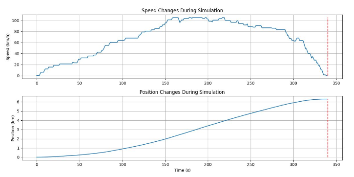
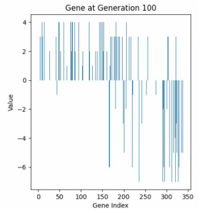

## 使用技術一覧

    

## プロジェクト名

進化計算を用いた鉄道GAを用いて鉄道の自動運転ができるかの実験

<!-- プロジェクトについて -->

## プロジェクトについて

授業で進化計算（GA）について学習したため、GAを用いた実用的な実験を行った。

今回の実験では鉄道を運転する際に使用するマスコンの操作を、時系列データに対して遺伝的情報を付与してハンドル操作のシミュレーションと最適化を行った。

## プログラム手順
1. 開始
2. 個体群の各染色体の初期遺伝子をランダムに決定
3. 下記をトーナメント選択にて繰り返す
   1. 全体の適合度を算出
   2. 適合度が高い順に全個体をソート
   3. 上位10%の個体を残し、残りを淘汰
   4. 上位10%の個体を複製し、残りは１点交差・突然変異
4. 最上位の適合値を保存して終了

## 実験結果の一例

