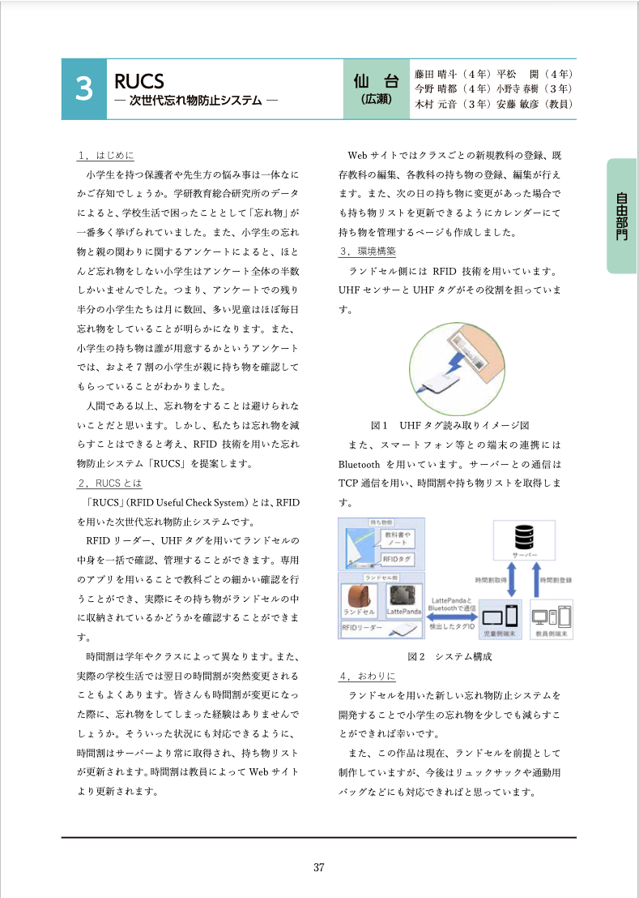

## 使用技術一覧

## プロジェクト名

RUCS
<!-- プロジェクトについて -->

## プロジェクトについて
コンテスト提出済みであるため一部ソースコードの公開は控えさせていただきます。
下記画像は[公式パンフレット](https://www.procon.gr.jp/?p=77939)より引用

## 備考
https://www.procon.gr.jp/?p=78105
