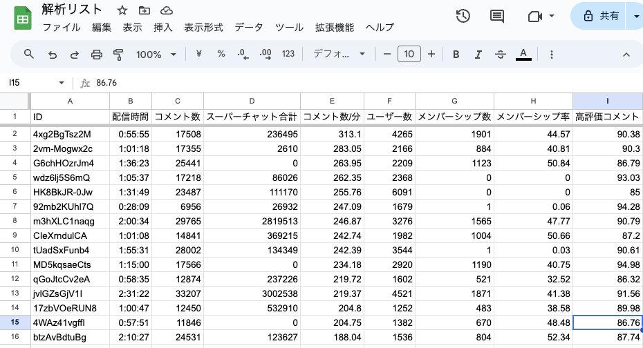

## 使用技術


## 概要
YouTube Liveのコメント欄のデータを収集・分析するためのツール

## 使用方法
```bash
python get.py 動画ID
```

## 動作例
<video src="./demo.mp4" controls="true"></video>


## 備考
Googleスプレッドシートと連携することで、さらにデータの可視化が簡単になりました。
また、スーパーチャットの合計額やチャット数についても表示できるようになりました。
